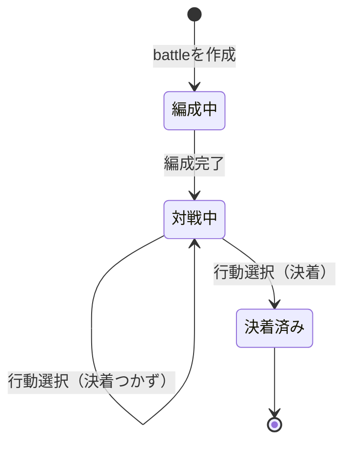

# 開発するに当たって

開発時に最初に知っておきたい情報。詳細はコードを参照。

## Directory

- /
  - .github/
    - workflow/
      - check.yml  
        開発時のチェックがある。通らないとmerge不可  
      - gh-pages.yml  
        github pagesの機能を使っているのでそのbuildを行う  
  - docs/
    ドキュメント  
  - src/
    - model/  
      データモデル、メインロジック  
    - data/  
      データの定義。駒、駒のアクション、駒に付与する状態を定義  
    - form/  
      入力formのデータモデル  
    - repository/  
      保存したデータやマスタデータを出し入れする  
    - controller/  
      modelとrepositoryを使って機能を実現する  
    - components/  
      画面の部品  
    - feature/  
      機能を実装した画面を定義する。特定のpathでも状態によって画面が違い、その単位での画面の定義。  
    - pages/  
      featureに定義した画面を、query stringや状態によって出し分けて表示する。こちらはpath単位で定義されている。  
  - test/  
    統合テスト  
  - package.json  
    開発コマンドが定義されているので要確認  

単体テストは、対象のファイルと同じディレクトリに配置する

## Model
データモデルは主にマスタ系と、実際に変化していくトランザクション系がある

- マスタ
  - Piece  
    駒の種類を定義する。実際に動かす駒はunitと呼び、unitはpieceという属性を持っている
  - Action  
    特定のPieceが取れる行動を定義する
  - Status  
    unitに付与する状態を表現する
- トランザクション
  - battle
    対戦本体

### Battle Lifecycle
battleはライフサイクルがあり、以下

## 画面
urlのpathごとの画面ではなく、機能ごとの画面のこと。pathの単位と一致しない。
ディレクトリでいうと、src/pagesとsrc/featureを組み合わせて表現される。
以下の画面がある。

- `/`  
  トップ画面
- `/list`  
  battleのlistを表示する  
- `/v1`
  query stringがない場合、version1のbattleを作成して開始できる
- `/v1?key=...` battleが編成中
  特定のbattleの編成画面が表示される
- `/v1?key=...` battleが対戦中/決着済み
  特定のbattleの決着状態が表示される。対戦中なら行動選択画面も

